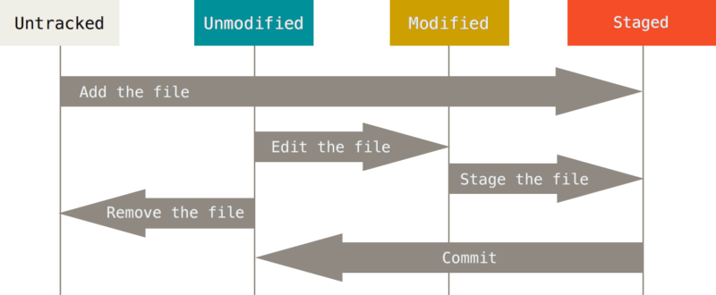

# Git

## 1.Git이란 무엇인가

- Git은 리누스 토르발즈가 개발한 분산 버전 관리 시스템이다.
- 분선 버전 관리 시스템은 중앙 집중식 버전 관리 시스템과 다르게 원격 저장소(remote repostiory)를 통하여 협업하고, 모든 히스토리를 클라이언트들이 공유한다.

## 2. Git 기초

- Git은 스냅샷 방식을 사용하여 다른 VCS와는 다르게 파일의 변화를 저장한다.
- 이러한 방식으로 인해 데이터의 크기가 작고 속도가 빠르다
- Git는 파일을 Commited, Modified, Staged로 구성된 세 가지 상태로 관리한다.
  - commited: 데이터가 커밋된 상태 (.git directory에 커밋된 상태)
  - modified:  수정한 파일을 아직 커밋하지 않은 상태 (Working Direcory 내에서 수정한 파일)
  - staged: 수정한 파일을 곧 커밋할 것이라고 표시한 상태 (add를 통해 Staging Area에 있는 상태)

- Git 파일의 라이프 사이클은 다음과 같다. (Unmodified는 commited라고 생각하면 된다.)

  

  

  

​	

## 3. Git 기초 명령어

`git init` : 로컬 저장소 생성

`git add <파일명>` : 특정 파일 폴더의 변경사항 추가

`git commit -m '<커밋메시지>'` : 커밋 (버전 기록)

`git status`: 상태 확인

`git log`: 버전 확인

