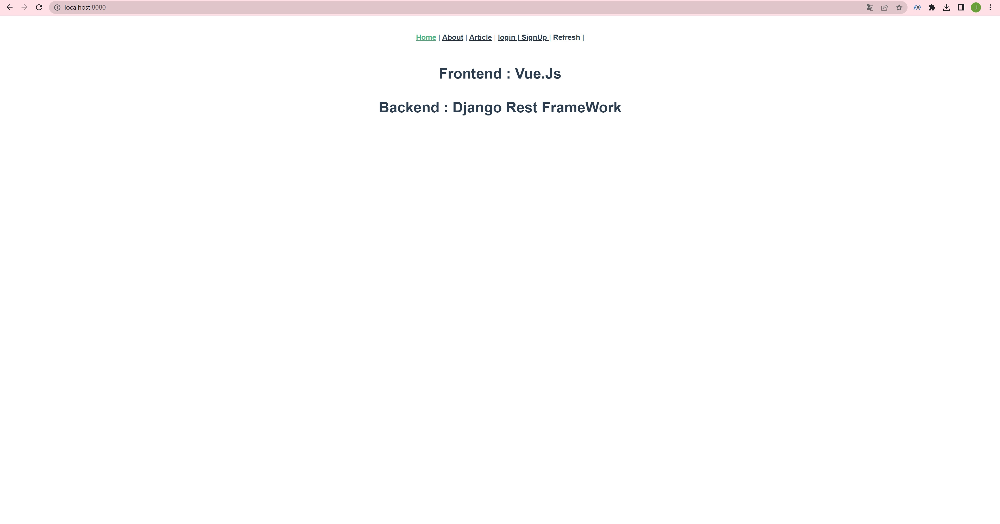
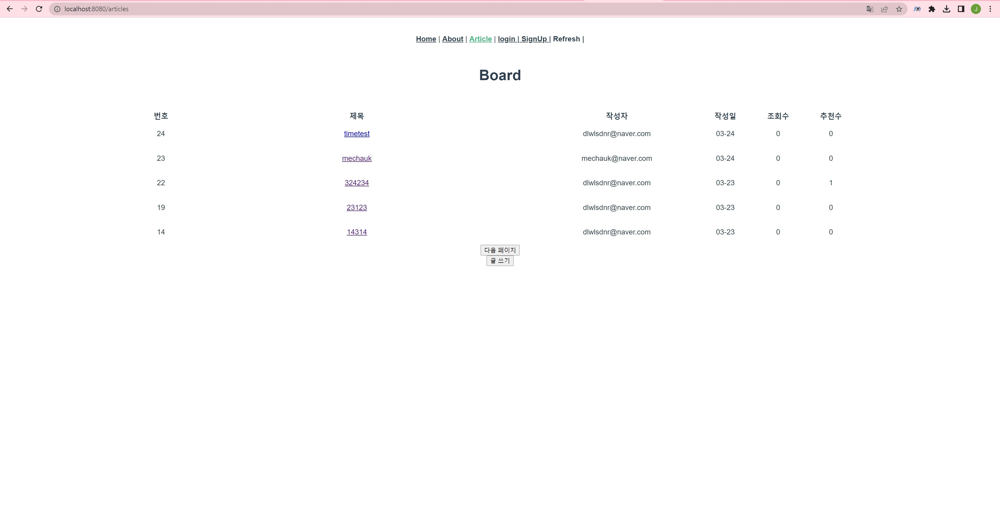
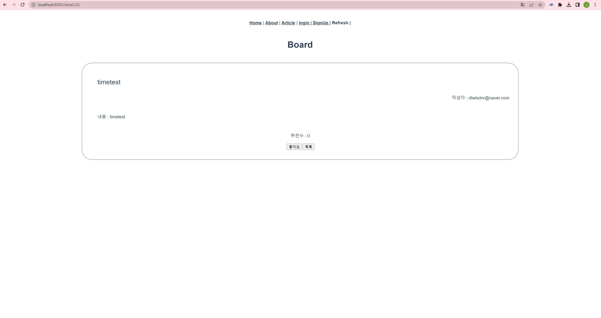
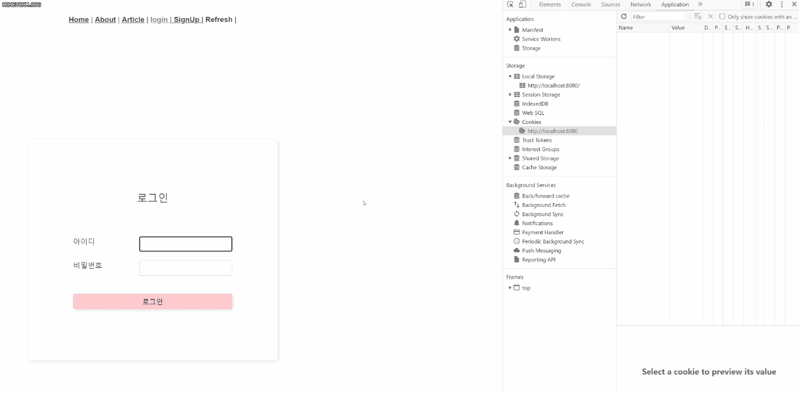
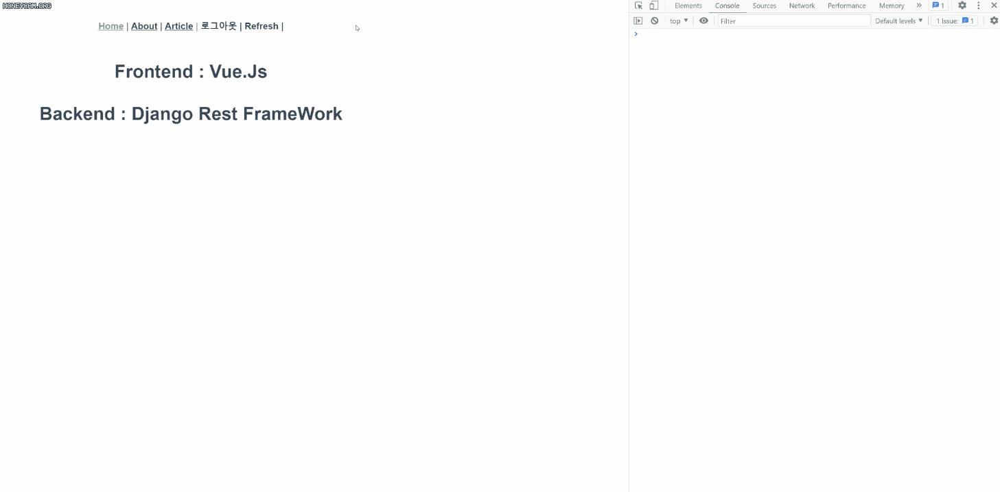

# Basic Board Webpage (DRF)


### 목표

<hr>

- 모든 웹페이지의 기본 설정인 로그인 및 CRUD 게시판을 구축한다.
- JWT 방식 로그인 및 토큰 관리를 구현한다.


### 모델

<hr>

가장 최소의 모델로만 구성하였다.

```
User
  - pk
  - email
  - created_at
  - is_admin
  - is_active
  - is_staff
  - is_superuser
  
Article
  - pk
  - title
  - content
  - created_at
  - user (fk)
  
Comment
  - pk
  - article (fk)
  - content
  - user
  - created_at
  
Like
  - article(fk)
  - user(fk)
```


### 기술 스택

<hr>

Backend : Python, DRF (Django Rest Framework)

Frontend : Vue.js


### 결과

<hr>





메인 페이지




게시판 목록


- 조회수는 미구현이며 간단한 페이징처리가 되어있다.

- 비로그인 유저도 글을 볼 수 있다.




게시글 상세보기

- 본인에게만 삭제 버튼이 보인다.





로그인화면

- http only 쿠키로 refresh token을 받아온다




Token Refresh

- access token이 만료되었을때 쿠키에 있는 refresh token으로 access token을 갱신할 수 있다.


