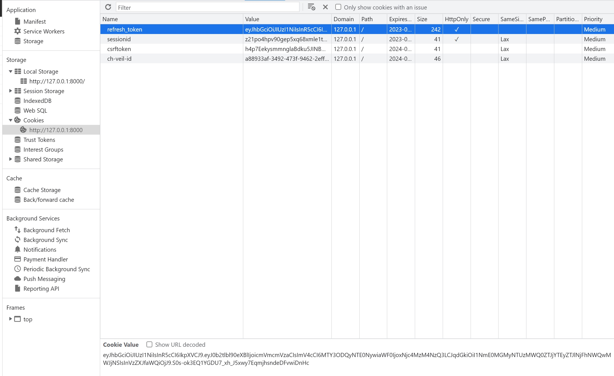

# simplejwt 에서 refresh token을 httponly 쿠키로 처리하기


JWT에서 token 탈취 방지를 위해 httponly 쿠키로 설정하는 것은 중요한 문제이다.


그런데 DRF에서 jwt 구현을 위한 simplejwt패키지는 이것을 따로 지원하지는 않는 것 같다.


https://github.com/jazzband/djangorestframework-simplejwt/issues/71


simplejwt 패키지의 해당 이슈를 보면 http only 쿠키를 만드는 것에 부정적인 자세를 보이고있다.


httponly 쿠키 구현을 위해 직접 코드를 올린 것을 찾을 수 있었다.


```python
# views.py
from rest_framework_simplejwt.views import TokenRefreshView, TokenObtainPairView
from rest_framework_simplejwt.serializers import TokenRefreshSerializer
from rest_framework_simplejwt.exceptions import InvalidToken

class CookieTokenRefreshSerializer(TokenRefreshSerializer):
    refresh = None
    def validate(self, attrs):
        attrs['refresh'] = self.context['request'].COOKIES.get('refresh_token')
        if attrs['refresh']:
            return super().validate(attrs)
        else:
            raise InvalidToken('No valid token found in cookie \'refresh_token\'')

class CookieTokenObtainPairView(TokenObtainPairView):
  def finalize_response(self, request, response, *args, **kwargs):
    if response.data.get('refresh'):
        cookie_max_age = 3600 * 24 * 14 # 14 days
        response.set_cookie('refresh_token', response.data['refresh'], max_age=cookie_max_age, httponly=True )
        del response.data['refresh']
    return super().finalize_response(request, response, *args, **kwargs)

class CookieTokenRefreshView(TokenRefreshView):
    def finalize_response(self, request, response, *args, **kwargs):
        if response.data.get('refresh'):
            cookie_max_age = 3600 * 24 * 14 # 14 days
            response.set_cookie('refresh_token', response.data['refresh'], max_age=cookie_max_age, httponly=True )
            del response.data['refresh']
        return super().finalize_response(request, response, *args, **kwargs)
    serializer_class = CookieTokenRefreshSerializer
```


```python
# url.py
from .views import CookieTokenRefreshView, CookieTokenObtainPairView # Import the above views
# [...]
urlpatterns = [
    path('auth/token/', CookieTokenObtainPairView.as_view(), name='token_obtain_pair'),
    path('auth/token/refresh/', CookieTokenRefreshView.as_view(), name='token_refresh'),
    # [...]
]
```


해당 코드를 입력해주고 엔드포인트로 가서 로그인을 하면 아래처럼 http only 쿠키에 refresh token이 생성된 것을 볼 수 있다.





그런데 프론트에서 로그인을 하면 쿠키가 생성되지 않는다.


response header의 set-cookie 에는 refresh 토큰이 제대로 들어오는 것을 보면 프론트에서도 따로 설정을 해주어야하는 것 같다.