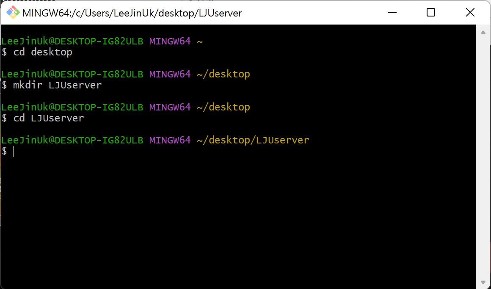
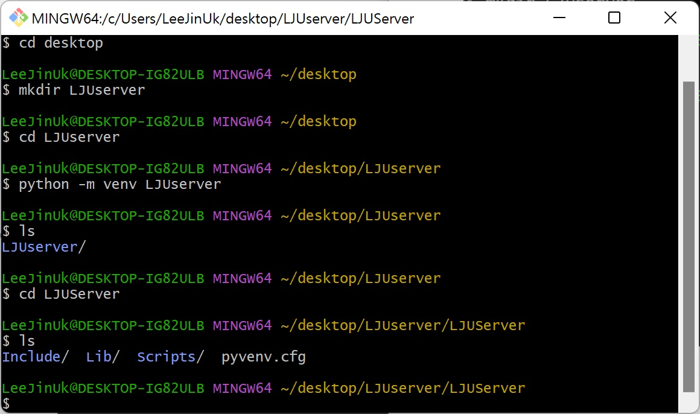
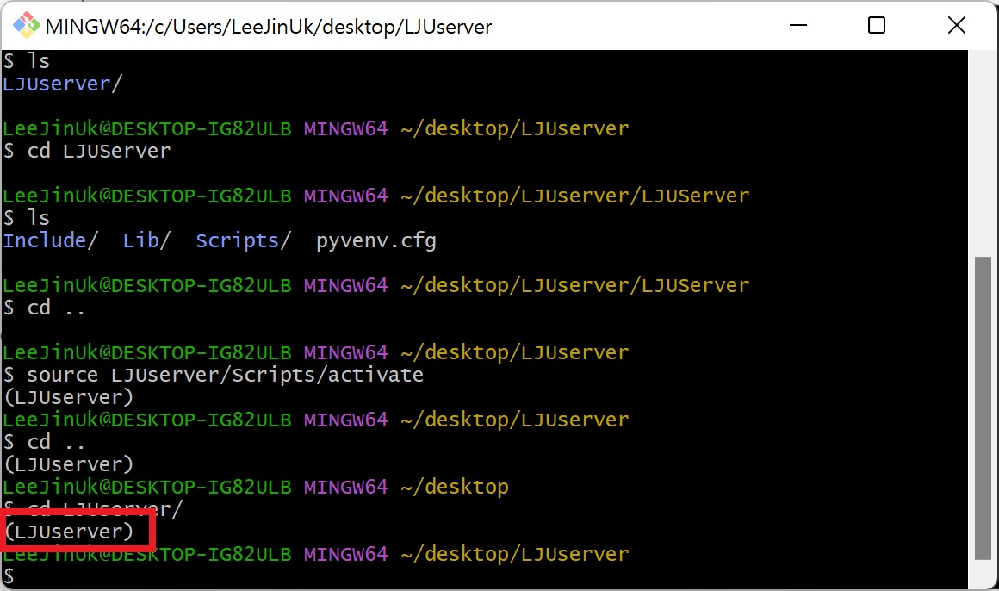
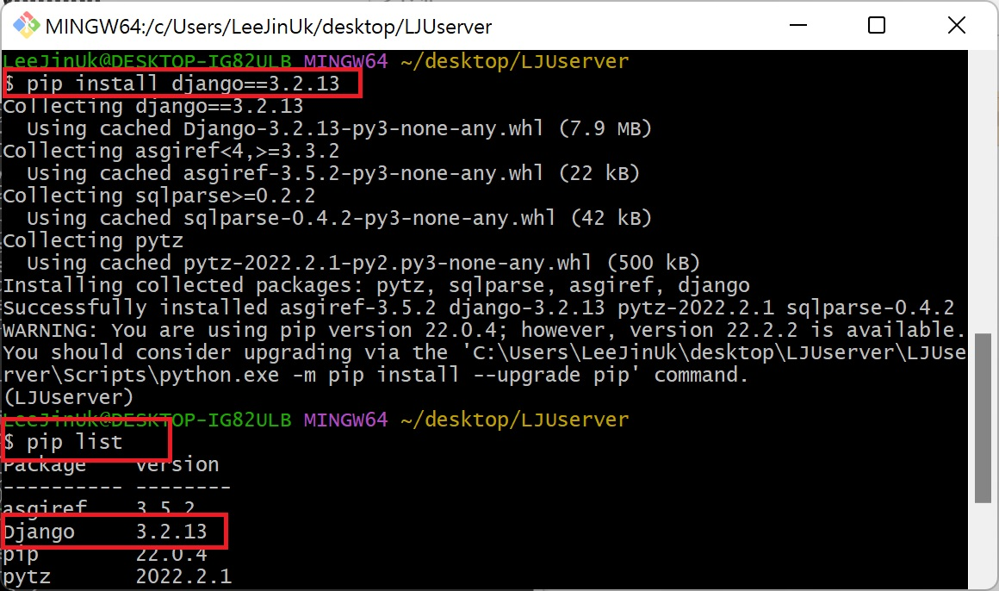
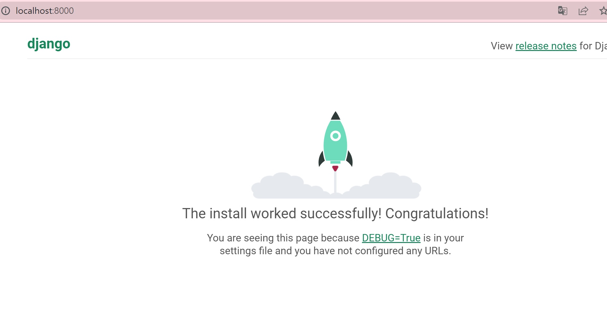

# Django 개발 환경 설정 가이드


1. 서버 폴더를 생성한다. (윈도우 환경에서 만들어도 된다.)

   <br>

   


2. 가상환경 만들기 / 활성화

   

   ```bash
   $ python -m venv [name] ## 가상 환경 만들기
   $ source [name]/Scripts/activate ## 가상 환경 실행
   $ deactivate ## 가상환경 종료
   ```

   

   <br>

   (가상환경이 제대로 만들어지면 해당 폴더에서 하위 폴더가 생성된 것을 확인할 수 있다.)

   <br>

   <BR>

   

   

   이후 가상환경을 실행해주면 체크한 부분처럼 가상환경이란 것을 알려준다.


3. LTS 버전 설치하기

   LTS(Long Term Support)는 장기 지원 버전의 줄임말로 말 그대로 장기적으로 지원하는 버전을 말한다. 장기적으로 지원하여 안정성에 중점을 두었기 때문에 상용화해서 쓰기 좋은 버전이다.

   ```bash
   $ pip install django==3.2.13 ## Django 설치 명령어
   $ pip list ## 해당 환경에서 설치된 pip를 보는 명령어
   ```

   

   

   설치를 하고 `pip list` 명령어를 통해 확인할 수 있다.


4. 프로젝트 생성

   ```bash
   $ django-admin startproject [프로젝트 이름] [설치 경로]
   ```

   해당 명령어를 통해 프로젝트를 생성할 수 있다.


5. 서버 실행

   ```bash
   $ python manage.py runserver
   ```

   

   <br>

   `localhost:8000` 으로 들어갔을때 서버가 성공적으로 실행되었다면 위와 같은 화면이 나온다.

