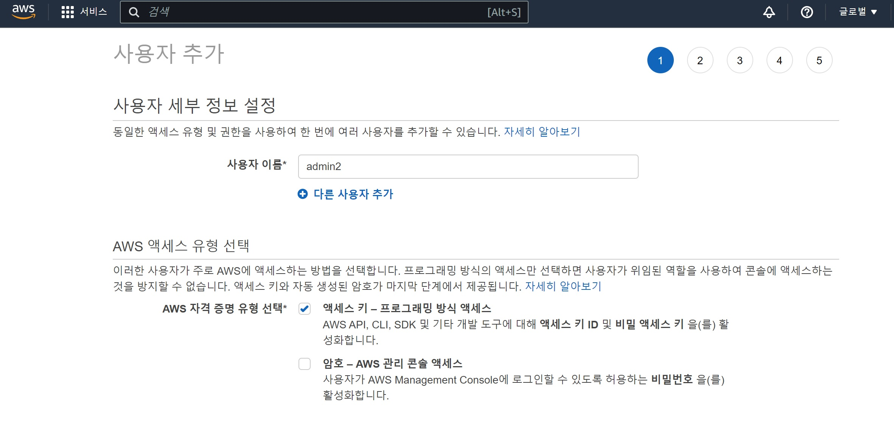
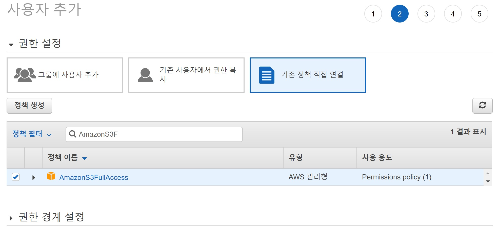
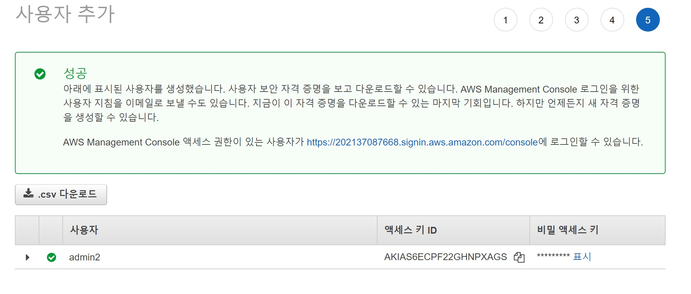
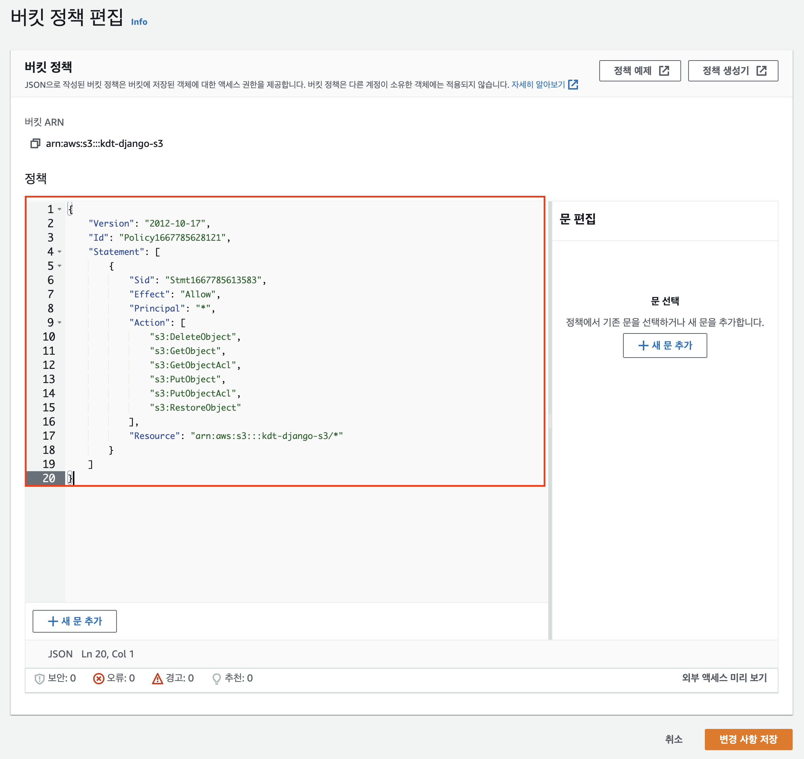

# AWS Elastic Beanstalk + Github actions 를 활용한 배포 (Django) - 1


AWS EB와 Github actions 을 활용해서 Django로 만든 사이트를 배포하고자 한다.


https://aws.amazon.com/ko < 요기로 접속하자.


## IAM


위의 AWS 링크로 접속했으면 `IAM` 으로 들어가자.

`IAM` 은 계정 권한 관리하는 그런 시스템 같다.


IAM으로 들어가면 사용자를 추가해준다. 



1. 사용자 이름 설정
2. 액세스 키 선택 후 다음





3. AmazonS3FullAccess 추가





4.  완료 하고 `.csv` 다운로드 (csv에서 AWS 관련 키값을 받을 수 있음)


## AWS S3


S3은 Simple Storage Service의 약자이다. 말 그대로 쉬운 저장소(Storage) 서비스가 S3이다.

S3은 Bucket(버킷) 과 Object(객체)로 구성되어있다. 객체는 우리가 생각하는 그 객체이고 버켓은 이러한 객체를 저장하여 관리하는 역할을 한다.

S3은 장점이 많다고 한다. (아직 잘 모르겠음)


1. AWS에서 `S3`을 검색하여 진입 후 버킷만들기를 한다.


2. 예시처럼 설정한다.

3. 생성한 버킷으로 들어가서 권한-버킷정책 편집으로 들어간다.

4. 정책생성기를 누르고 아래와 같이 설정한다.

   ```
   Step 1: Select policy Type = S3 Bucket Policy
   Step 2: Add statement(s)
   
   Effect - Allow
   Principal - *
   Actions 
   - DeleteObject
   - GetObject
   - GetObjectAcl
   - PutObject
   - PutObjectAcl
   Amazon Resource Name
   - arn:aws:s3:::[버킷이름]/*
   - Amazon Resource Name 예시) arn:aws:s3:::kdt-django-s3/*
   ```

   이처럼 설정했으면 `Generate plicy` 를 클릭하여 작성된 정책을 복사한다.





5. 생성한 정책을 붙여넣고 저장한다.


## DjangoS3


### 패키지 설치

```bash
pip install django-storages
pip install boto3 
pip install python-dotenv
pip freeze > requirements.txt
```


## .env

```python
AWS_ACCESS_KEY_ID = [IAM 사용자 Access key ID]
AWS_SECRET_ACCESS_KEY = [IAM 사용자 Secret access key]
AWS_STORAGE_BUCKET_NAME = [S3 버킷 이름]
```


## settings.py

```python
import os
from dotenv import load_dotenv
load_dotenv()


INSTALLED_APPS = [
	"storages", # storages 추가
	# ... 이하 생략
]
	
"""
기존 MEDIA 설정 주석
MEDIA_ROOT = ...
MEDIA_URL = ...
"""

# 아래 코드 추가
DEFAULT_FILE_STORAGE = "storages.backends.s3boto3.S3Boto3Storage"

AWS_ACCESS_KEY_ID = os.getenv("AWS_ACCESS_KEY_ID")
AWS_SECRET_ACCESS_KEY = os.getenv("AWS_SECRET_ACCESS_KEY")
AWS_STORAGE_BUCKET_NAME = os.getenv("AWS_STORAGE_BUCKET_NAME")

AWS_REGION = "ap-northeast-2"
AWS_S3_CUSTOM_DOMAIN = "%s.s3.%s.amazonaws.com" % (
    AWS_STORAGE_BUCKET_NAME,
    AWS_REGION,
)
```


## 개발/배포환경 분리


## .env

```python
DEBUT = True
```


## settings.py

```python
# settings.py

"""
기타 환경에 따라 설정 분리가 필요한 경우 코드를 분리해서 추가로 작성합니다. 
"""

DEBUG = os.getenv("DEBUG") == "True"

if DEBUG: 
    MEDIA_URL = "/media/"
    MEDIA_ROOT = BASE_DIR / "media"

else:   
    DEFAULT_FILE_STORAGE = "storages.backends.s3boto3.S3Boto3Storage"

    AWS_ACCESS_KEY_ID = os.getenv("AWS_ACCESS_KEY_ID")
    AWS_SECRET_ACCESS_KEY = os.getenv("AWS_SECRET_ACCESS_KEY")
    AWS_STORAGE_BUCKET_NAME = os.getenv("AWS_STORAGE_BUCKET_NAME")

    AWS_REGION = "ap-northeast-2"
    AWS_S3_CUSTOM_DOMAIN = "%s.s3.%s.amazonaws.com" % (
        AWS_STORAGE_BUCKET_NAME,
        AWS_REGION,
    )
```

