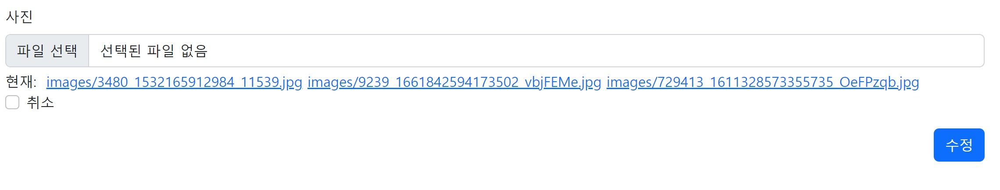

# Django 다중 이미지 업로드 수정 기능 구현




Django를 활용하여 다중 이미지를 입력해봤는데 수정 기능에 대한 설명이 찾기 힘들어서 직접 구현해봤다.


## update.html

```html
<form action="" method="POST" class="" enctype="multipart/form-data">
    
    
    <div class="mb-3">
      <label class="form-label" for="id_image">사진</label>
      <input type="file" name="imgs" multiple accept="image/*" class="form-control" id="id_image">
      
      <div class="row mt-1">
        <div class="col-auto">
            현재:&nbsp;
            
            <a href="{{ photo.image.url }}">{{ photo.image }}</a>
            
        </div>
        <div class="col-auto">
          <div class="form-check">
              <input type="checkbox" name="image-clear" id="image-clear_id" class="form-check-input">
              <!-- name은 views.py에서 받아와야할 이름이다  -->
              <label for="image-clear_id" class="form-check-label">취소</label>
          </div>
        </div>
      </div>
      
    </div>
    <div class="text-end"><input class="btn btn-primary" type="submit" value="수정"></div>
  </form>
```


`create.html` 이 간단한 것에 비해 수정은 현재 입력되어있는 파일명을 넣기 위해 조금 복잡하다.

또한, 체크박스에서 기존의 이미지를 삭제할건지 체크해서 ` views.py`로 넘겨주어야한다.


## views.py

```python
@login_required
def update(request, post_pk):
    post = Post.objects.get(pk=post_pk)
    photo_list = post.photo_set.all() # post의 이미지를 photo_list에 받아온다.
    if post.user == request.user:
        if request.method == "POST":
            post_form = PostForm(request.POST, request.FILES, instance=post)
            if post_form.is_valid():
                post = post_form.save(commit=False)
                post.save()

                if request.FILES.getlist('imgs'): # 만약 이미지를 입력했다면
                    for i in photo_list: # photo_list의 이미지를 모두 삭제한다.
                        i.delete()  # 이미지를 모두 삭제하고 다시 추가함.
                    for img in request.FILES.getlist('imgs'): 
                        # Photo 객체를 하나 생성한다.
                        photo = Photo()
                        # 외래키로 현재 생성한 Post의 기본키를 참조한다.
                        photo.post = post
                        # imgs로부터 가져온 이미지 파일 하나를 저장한다.
                        photo.image = img
                        # 데이터베이스에 저장
                        photo.save()
                    return redirect("posts:detail", post.pk)

                else: # 만약 이미지가 입력되지 않았다면
                    if request.POST.getlist('image-clear'): # 입력된 이미지를 삭제할건지 체크여부 확인
                        for i in photo_list:
                            i.delete()                        

                    return redirect("posts:detail", post.pk)

        else:
            post_form = PostForm(instance=post)

        context = {
            "post_form": post_form,
            "photo_list":photo_list,
        }
        return render(request, "posts/update.html", context)

    else:
        return HttpResponseForbidden()
```


`create` 와 비슷한데 사진을 개별로 삭제하고 추가하는 것이 어려워서 다음과 같이 처리했다.

수정 버튼을 눌러서 `request` 를 보냈을때

1. 이미지를 입력하지 않았다면 기존 파일 삭제 체크 박스를 확인하여 이미지를 유지 / 삭제하며 글을 수정한다.
2. 이미지를 입력했다면 기존의 이미지를 모두 삭제하고 새로 입력된 이미지로 바꾼다.


동작 자체는 크게 문제 없지만 글을 수정하면서 이미지만 추가하고 싶을때는 기존의 이미지를 새롭게 다시 추가해야하는 번거로움이 있다.

다음에는 이미지박스처럼 개별로 이미지를 추가하고 삭제할 수 있는 방향으로 구현해야겠다.