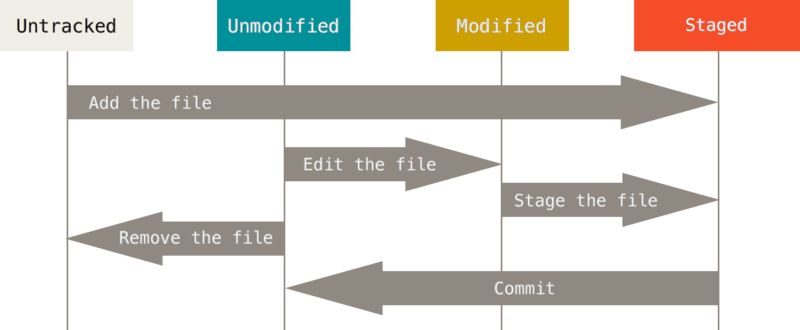
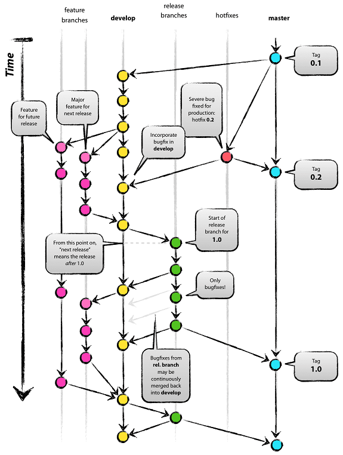

# Git


## 1.Git이란 무엇인가


- Git은 리누스 토르발즈가 개발한 분산 버전 관리 시스템이다.
- 분선 버전 관리 시스템은 중앙 집중식 버전 관리 시스템과 다르게 원격 저장소(remote repostiory)를 통하여 협업하고, 모든 히스토리를 클라이언트들이 공유한다.


## 2. Git 기초


- Git은 스냅샷 방식을 사용하여 다른 VCS와는 다르게 파일의 변화를 저장한다.

- 이러한 방식으로 인해 데이터의 크기가 작고 속도가 빠르다

- Git는 파일을 Commited, Modified, Staged로 구성된 세 가지 상태로 관리한다.
  - commited: 데이터가 커밋된 상태 (.git directory에 커밋된 상태)
  - modified:  수정한 파일을 아직 커밋하지 않은 상태 (Working Direcory 내에서 수정한 파일)
  - staged: 수정한 파일을 곧 커밋할 것이라고 표시한 상태 (add를 통해 Staging Area에 있는 상태)
  
  


- Git 파일의 라이프 사이클은 다음과 같다. (Unmodified는 commited라고 생각하면 된다.)

  

  

  

​	

## 3. Git 기초 명령어


`git init` : 로컬 저장소 생성

`git add <파일명>` : 특정 파일 폴더의 변경사항 추가

`git commit -m '<커밋메시지>'` : 커밋 (버전 기록)

`git status`: 상태 확인

`git log`: 버전 확인


* 아래는 CIL 기초 명령어이다.

  

`touch`: 파일 생성

`rm`: 파일 제거

`mkdir`: 폴더 생성 (make diretory)

`cd <폴더명>`: 폴더로 이동

`cd ..`: 상위 폴더로 이동


##  4. 원격 저장소 사용하기


1. Github에서 원격저장소를 만든다.

2. Github에서 다음과 같은 원격 저장소 정보를 준다.

   

   Github Username = mechauk418

   repostiory name = addnum

3. 원격 저장소 정보를 로컬 저장소에 추가

   ```bash
   $ git remote add origin https://github.com/mechauk418/addnum.git
   ```

   원격 저장소 정보를 추가했으면 본격적으로 사용 가능하다.


## 5. 원격 저장소 활용


- 원격 저장소 정보를 확인할 때는 다음과 같은 명령어를 사용한다.

  ```bash
  $ git remote -v
  ```

  아래의 그림처럼 원격저장소의 이름(origin)과 URL을 출력한다.

  

  

  

- 원격 저장소로 로컬 저장소의 변경사항을 등록할때는 다음과 같은 명령어를 사용한다.

  ```bash
  $ git push <원격저장소 이름> <브랜치이름>
  ```

  

- 원격 저장소에서 변경사항을 받아와 로컬 저장소로 등록할때는 다음과 같은 명령어를 사용한다.

  ```bash
  $ git pull <원격저장소 이름> <브랜치이름>
  ```


## 6. Git Flow


- Git를 활용하여 협업하는 흐름으로 branch를 활용하는 전략을 의미한다.

- 가장 대표적으로 활용되는 전략은 아래와 같다.

  

  

  


## 7. Branch 관련 명령어


`git branch` : 브랜치 조회

`git branch example`: example 라는 브랜치 생성

`git checkout example`: example 라는 브랜치로 이동

`git checkout -b example` : example 라는 브랜치를 생성하면서 이동

`git merge example`: example 라는 브랜치를 현재 브랜치에 병합


## 8. merge 


## 9. Fork & Pull request


포크(fork)는 개발자들이 소프트웨어 소스코드를 복사하여 새로운 소프트웨어를 개발하는 것을 말한다. 


pull requests -> new pull request


## 참고 자료


[git-scm.com](https://git-scm.com/book/ko/v2/%EC%8B%9C%EC%9E%91%ED%95%98%EA%B8%B0-Git-%EA%B8%B0%EC%B4%88) (Git 공식 홈페이지)

[https://nvie.com/posts/a-successful-git-branching-model/](https://nvie.com/posts/a-successful-git-branching-model/) (Git flow)
