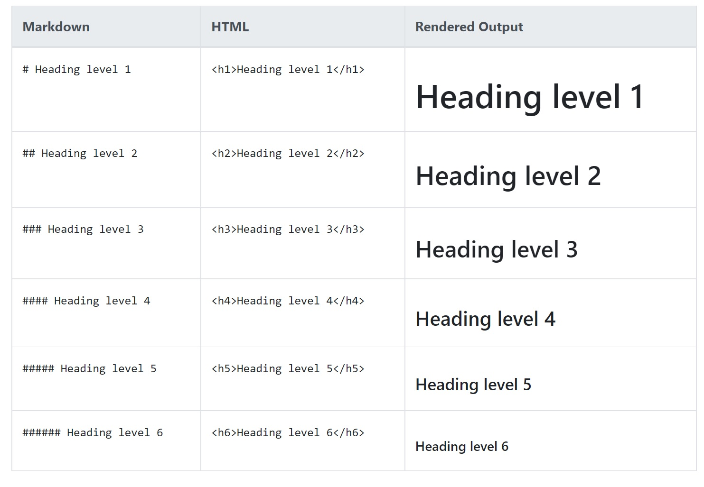
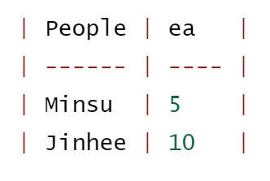

# 마크다운


## 1. 마크다운이란

- 존 그루버가 만든 텍스트 기반의 가벼운 마크업 언어 (XML, HTML 등이 마크업 언어)


## 2. 마크다운 특징

- 마크다운은 가능한 읽을 수 있도록 최소한의 문법으로 구조화
- 단순 텍스트 문법으로 내용을 작성하며, 다양한 환경에서 변환하여 보여짐
- Github나 기술블로그, 개발 환경, 일반 SW에서 활용 (ex. Github, Notion, Jupyter Notebook)


## 3. 마크다운 문법


### 1) Heading

- 문서의 제목이나 소제목으로 사용

- `# ~ ######` 개수에 따라 크기를 조절 가능

  

---

### 2) List

- List는 순서가 있는 리스트와 없는 리스트로 구성
- `(- or * or +) + space` : 순서가 없는 리스트
- `숫자. + space` : 순서가 있는 리스트 (마침표를 사용할 것)
  - Tab과 Shift + Tab을 활용하여 작은 리스트와 큰 리스트로 이동 가능

---

### 3) Fenced Code Block


- 펜스드 코드 블록은 backtick(`) 기호 3개를 활용하여 작성

- ` ```python ` 처럼 다음과 같이 특정 언어를 명시하여 Syntax Highlighting 적용 가능

  ```python
  print('t')
  ```

  ```bash
  $ git init
  ```

  

---


### 4) Inline Code block

- 인라인 코드 블록은 backtick 기호 1개를 활용하여 작성
- `다음과 같이 원하는 내용을 backtick으로 감싸준다.`


---


### 5) Link

- `[문자열](url)` 을 통해 링크를 작성 가능

- 특정 파일을 포함하여 연결할 수 있다.

  

---


### 6) Image

- `` 을 통해 이미지를 사용 가능

- 특정 파일을 포함하여 연결할 수 있다.

  

---


 ### 7) Blockquotes

- `>` 을 통해 인용문을 작성 가능

  > `github.com/mechauk418`


---

### 8) Table

- 표는 아래의 문법과 같이 입력할 수 있다.
- 그러나 Typora 같은 프로그램을 활용해 쉽게 입력하는 것이 좋다.



| People | ea   |
| ------ | ---- |
| Minsu  | 5    |
| Jinhee | 10   |


---


### 9) text 강조

- `**<text>**` : **굵게**
- `*<text>*`: *기울임*
- `~~<text>~~`: ~~취소선~~


---


### 10) 수평선

- 3개 이상의 ***, ---, ___ 으로 사용


---


# 참고 자료


- Markdown Guide ([https://www.markdownguide.org](https://www.markdownguide.org))


