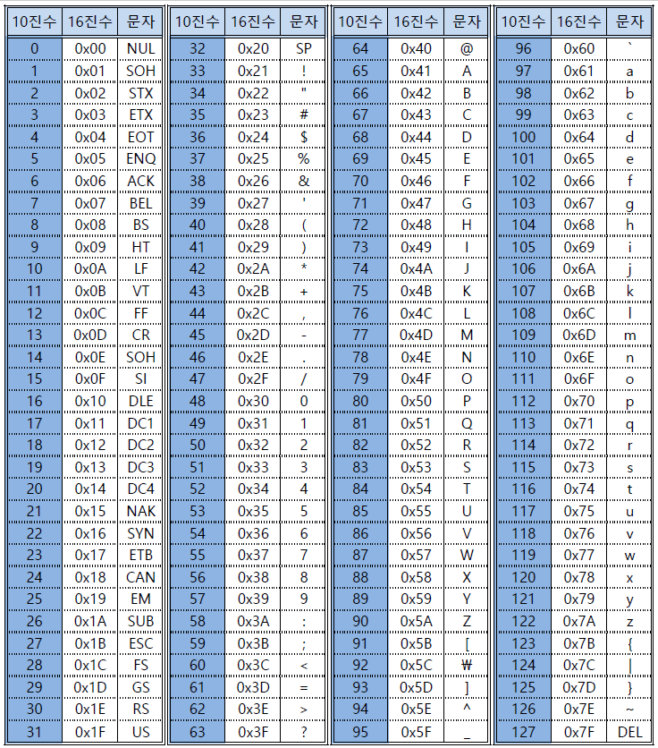

# chr(), ord()

`chr()` 은 숫자를 인수로 받아 해당 정수에 해당하는 아스키코드 문자를 반환하는 내장함수다.

`ord()` 은 반대로 문자를 인수로 받아 해당 문자에 해당하는 아스키코드 정수를 반환하는 내장함수이다.


```python
print(ord('a')) # ans : 97
print(chr(97)) # ans : a
```


아스키코드는 아래의 표를 참고하면 된다.





표를 보면 16진수도 같이 나와있는데, hex()를 사용하면 16진수도 활용할 수 있다.

```python
print(chr(0x61)) # ans : a
print(ord('a')) # ans : 0x61
```


## 참고


아스키코드 표 (https://naturalfi.tistory.com/4 )